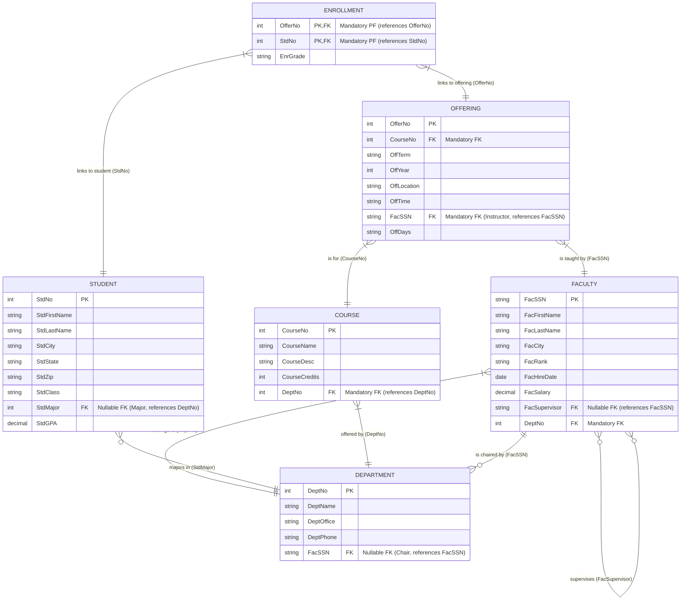

# Database Development

Database development is an ambiguous, subjective, requires creative problem-solving. Focuses on designing and building the database structure itself. Offers the potential for longer-term, significant organizational impact.

>[!Note]
>A database acts as the **"long-term memory"** for an information system, storing data about essential entities (like students, loans, products) and their relationships.

The database structure (table names, column names) should define terms consistently, facilitating communication among diverse users. The database should enforce the organization's rules about its data.

Data should be accurate, consistent, and reliable. Poor data quality leads to poor decisions, communication errors, and customer dissatisfaction. The database must perform well enough for users to get the information they need in a timely manner. Slow performance can render a database useless, *but* efficiency shouldn't be achieved by sacrificing data meaning (rules) or quality.

## Database Development Process

- Defining *what* information the database needs to store, independent of any specific database system.
- Translating the conceptual model (ERD) into a format suitable for a specific *type* of database system.
- Planning how data is spread across multiple locations/servers.
- Deciding on the specific storage structures, indexing strategies, and other performance-tuning details for a particular Database Management System.

## Integrity Rules

Entity integrity ensures that each table has a primary key and that no primary key value is null.  This guarantees unique identification of entities.  Referential Integrity ensures that relationships between tables are valid.  Foreign key values must either match a primary key value in the related table or be null (if the foreign key allows nulls). 

These rules allow you to *uniquely* identify each entity. Having duplicates means you can't reliably distinguish between them, leading to errors in billing, reporting, security, and more. 

## Table Constraints

- Primary and Foreign key constraints enforce uniqueness, no-nulls, and relationships between tables respectively.
- Unique constraints ensures that columns have unique values but can have null values. You can pass NOT NULL to remove them.
- Check constraints only return results that match the criteria being passed.

Constraints can be either in-line(part of the column definition) or can be added in the SELECT query if using multiple tables.

>[!Note]
>Meaningful constraint names make it easier to diagnose errors when a constraint is violated. It is optional, but *highly recommended*.  

## Related Notes

