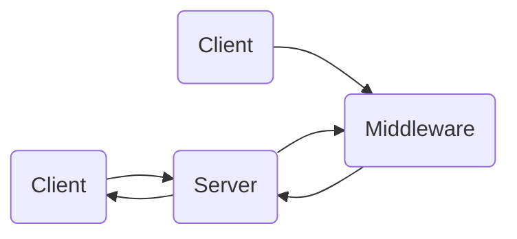

# Database Architecture

A database architecture describes the design and structure of a database system. It defines how data is collected, stored, accessed, managed, and used. It dictates the layout, components, and how everything interacts to achieve a specific purpose.

The most commonly used architecture is the three-tier architecture. Proposed in 1970s as a way to achieve data independence.

>[!Note]
>Data independence means that a database should have an identity separate from the applications that use it. 

- External level is the user-level where each group of users can have a separate external view of the database tailored to their specific needs.
- Conceptual level is where the entity types and relationships for the entire database.
- Internal level is the the storage view of the entire database, describing how the data is physically stored on the disk.

The Client-Server architecture divide processing capabilities between a client and a server. The client typically handles the user interface, while the server manages the database.

>[!Note]
>There can be multiple tiers, where the client interacts with a middle-ware server, which then interacts with a database server. 

Parallel processing architectures utilize tightly-coupled computing resources to improve performance and availability. They can be implemented using shared disk or shared nothing approaches. 

In shared disk systems, the processors share all disks but nothing is shared across clusters. In shared nothing architectures, processors share no resources, but each cluster works in parallel to perform a task.

Distributed processing allows geographically dispersed computers to cooperate when providing data access. Distributed databases provide local control and reduce communication costs by locating data where it is most frequently used.

## Related Notes