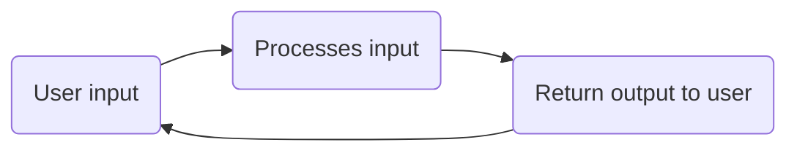

# Introduction to ChatGPT

ChatGPT, by OpenAI, is a chatbot application, which means it can answer questions or perform tasks based on user-inputted text. This may not sound much different to a traditional chatbot, but ChatGPT is much more than that. 

Traditional chatbots were usually designed to return a predetermined response to a limited number of questions. ChatGPT is far more generalizable, as it uses its understanding of language to interpret the question or task and determine the most appropriate response. This means that ChatGPT has a wide range of potential applications.

ChatGPT uses generative AI to respond to users. Generative AI is a subset of artificial intelligence, or AI, and machine learning, where a model creates new content based on patterns in information it has already seen.

Although ChatGPT is a valuable tool that can perform a huge variety of tasks, there are some limitations to be aware of to use it effectively. ChatGPT's text-generation capabilities come from a large language model, or LLM, which sits at the heart of the application. The LLM interprets the prompt and generates relevant text in response based on its understanding of language. 

## Training and Limitations
ChatGPT uses LLMs that are trained by OpenAI on various different topics and formats, it can detect patterns in words and then uses the data it was trained on to generate its response.

> OpenAI has fine-tuned the LLMs so that the response can be accurate as possible.

ChatGPT has knowledge only about the data that the LLM was trained on. There are cutoff dates on the training data of LLMs and it can't recall or tell you information that happened after the cutoff date. OpenAI updates the LLMs with new data so it can perform better.

ChatGPT also has other limitations like it cannot shift its context to multiple topics if we do so the LLM will start to hallucinate and produce inaccurate results or sometimes straight up gibberish.

## Prompt Engineering
Have you heard the phrase garbage in, garbage out? This has never been more appropriate than with using ChatGPT - if the prompt we provide doesn't contain sufficient context or isn't written in an easily interpretable way, chances are it will lower the quality of the response.

- Be clear and specific.
- Keep prompts concise.
- Make sure grammar and spellings are correct.
- Provide example if possible.

## Related Notes