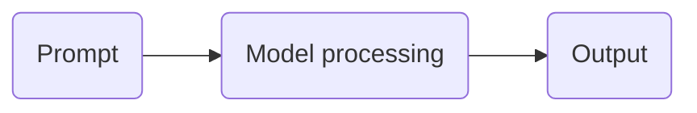

# Introduction to Generative AI

Generative AI is a type of AI that can create new content, such as text, images, or other media. A key feature of generative AI is that it can be used with natural language, which is how people communicate through speaking or writing.

Here's how a generative AI tool works:

Generative AI has introduced new possibilities for what people can create with AI. It can help with creating content like marketing posters. If the initial output is not satisfactory, users can provide additional instructions to refine the content. Generative AI can also boost productivity, help avoid mistakes, and improve decision-making.

Conversational AI is a type of generative AI that processes text requests and generates text responses. This type of tool can be used to brainstorm ideas, answer questions, and boost productivity.

> Gemini, a conversational AI tool by Google, can be used to get creative inspiration, build on ideas, and provide detailed explanations on various topics.

## Related Notes